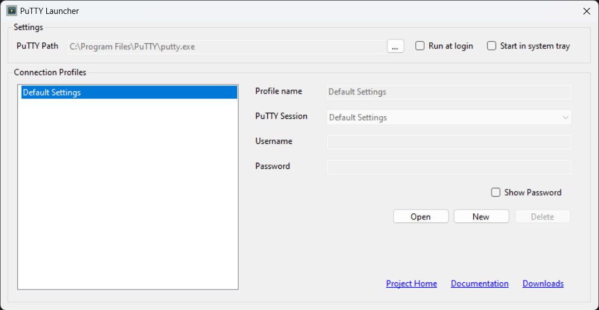

# PuttyLauncher

PuTTYLauncher is a simple Windows desktop application that can be used to launch pre-configured PuTTY sessions, and when launching SSH sessions a username and password can be provided, resulting in an automated login process. When you launch PuTTYLauncher for the first time, this is what you will see:

# Settings

### PuTTY Path

When you first start PuTTYLauncher it will attempt to locate the PuTTY executable on your system, but if you have a non-standard install you can click the "..." button to browse for and locate putty.exe yourself.

### Run at login

If you find PuTTYLauncher useful and would like it to start automatically each time you log in, check the "Run at login" box.

### Start in system tray

PuTTYLauncher presents a system tray icon with entries for each of your connection profiles. This means that connecting to, and for SSH sessions also loggin in to each of your your remote systems is potentially just two clicks away. If you would like PuTTYLauncher to start minimized in the system tray, check the "Start in system tray" box.

# Connection Profile Properties

### Profile name

A connection profile name is the name by which a connection is identified within PuTTYLauncher. It's a good idea to keep your connection profile names unique, but it's not an absolute requirement to do so. Profile names apear in the profiles list in the main window, and also in the right-click contect menu of the system tray icon.

### PuTTY Session

As the name suggests, the PuTTY session is the name of the PuTTY session that will be launched when you open the profile. PuTTY stores these sessions in the Windows Registry, so PuTTYLauncher reads them from there and allows you to pick which session you wish to use for each connection profile.

### Username

The username field allows you to configure the username that will be passed to the system that you are connecting to. Passing a username only works for SSH connections.

### Password

The password field allows you to configure the password that will be passed to the system that you are connecting to. Passing a password only works for SSH connections.

# Connection Profiles

A conection profile is a named combination of a PuTTY session, a username and a password.

### Creating a Connection Profile

Click the "New" button to ctreate a new connection profile, then enter a profile name, select the PuTTY session to be used, and for SSH connections, optionally enter the username and password to be used to log in to the target system. After clicking the "New" button you have the option of clicking a "Save" button to save the new profile, or a "Cancel" button to discard any new information entered.

### Editing a Connection Profile

To edit a connection profile, select the profile in the profiles list and change the values in the Profile name, PuTTY Session, Username and Password fields as necessary. Changes are saved automatically.

### Deleting a Connection Profile

To delete a connection profile, select the profile in the profiles list and click the "Delete" button. You will be prompted to confirm that you want to delete the profile.

# Saved Settings

Settings and connection profiles are saved to a configuration file named `PuTTYLauncher.json` which is stored in your `Documents` folder.

### Password Encryption

Any passwords that you enter are immediately encrypted before being saved to the configuration file. We use Windows DPAPI Encryption which is based on enctryption keys provided by Windows and associated with your Windows login. This means that the stored passwords can only be decrypted when logged into the same Windows user account that was used to encrypt them in the first place.

